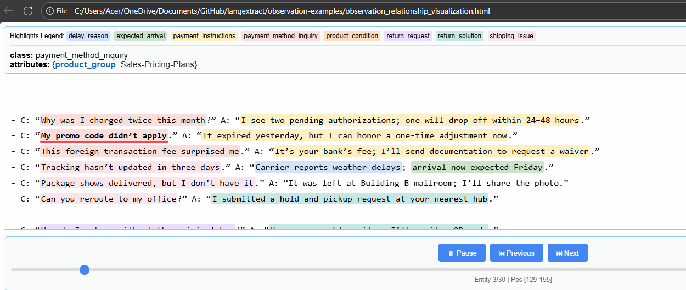

## 🧾 Customer Complaint Pattern Extraction

Given a list of customer complaints written in unstructured sentences, this tool extracts and identifies recurring structures or patterns from the input list.

### ✨ Example Output
- Complaint Type: Delivery Delay
- Pattern: "I haven't received my order yet"
- Complaint Type: Product Quality
- Pattern: "The item was broken when it arrived"

### 📽️ Demo

### References
https://github.com/google/langextract/tree/main
